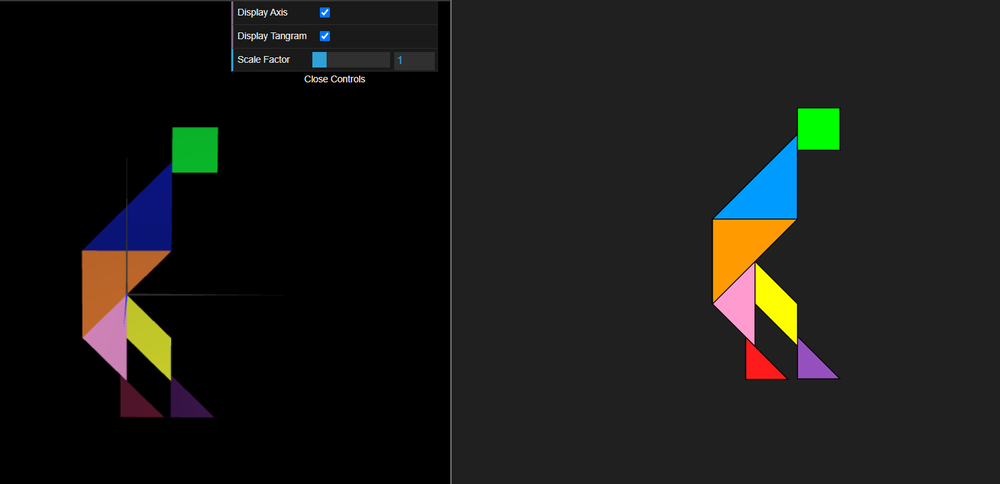
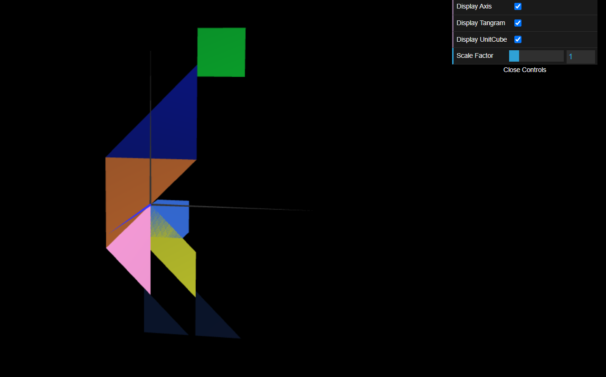
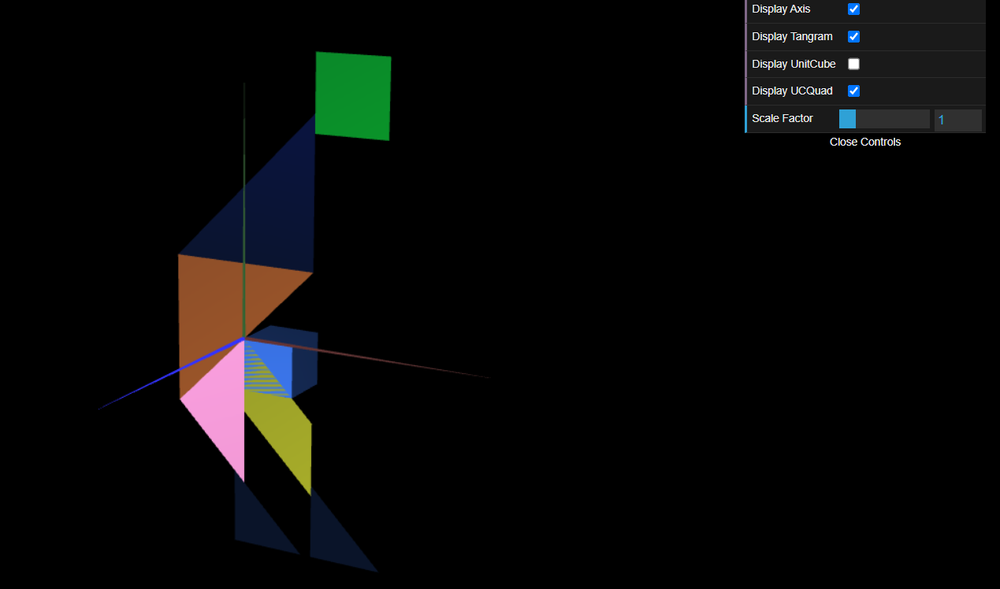

# CG 2024/2025

## Group T11G05

## TP 2 Notes

### 2-1

- We had doubt about the rotation on the Z axis so we ended up using scale -1
- We had problems creating the myTangram class because we didnt know about the .scene in all transformations

### 2-2

- We had no problems

### 2-3

- Once again we faced no problems

