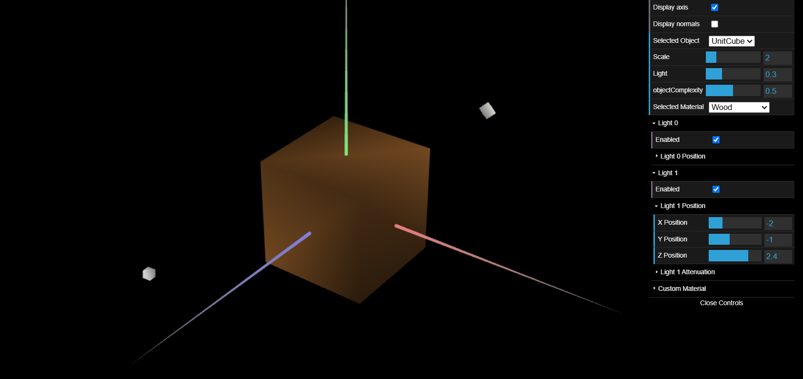
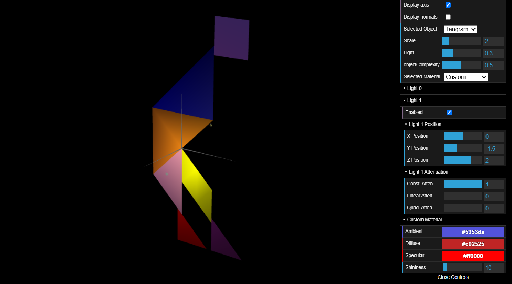
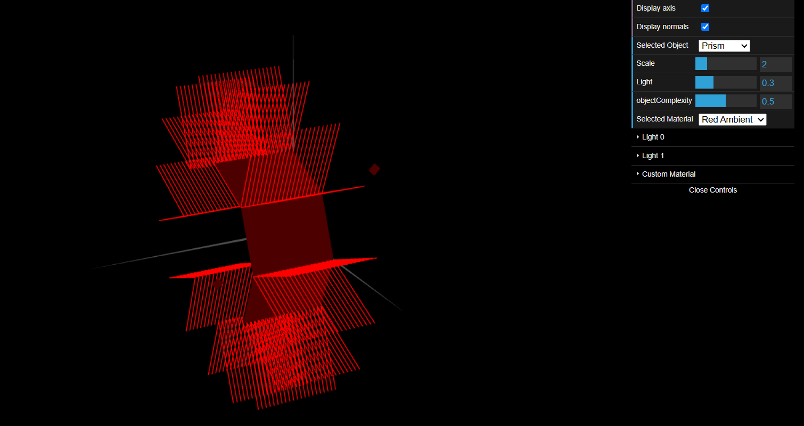
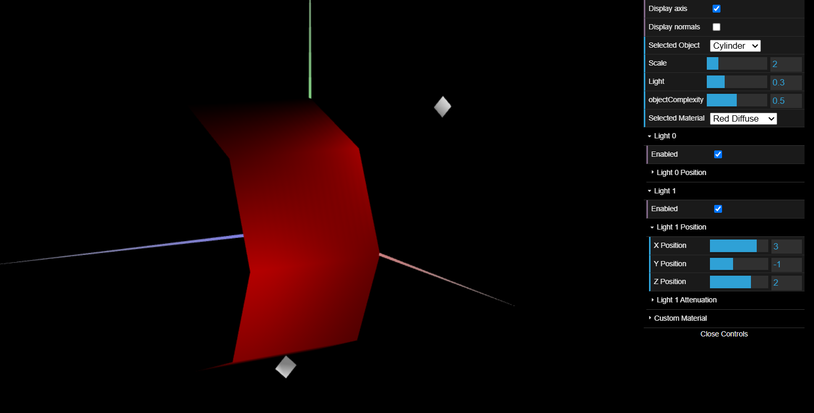

# CG 2024/2025

## Group T11G05

## TP 3 Notes

### 3-1 and 3-2

- Some initial problems understanding how to correctly assign normals

- Wrong values on Ambient made a shrek.

### 3-3

- Took a while to understand what was supposed to do with the stacks on part 9

### 3-4

-

