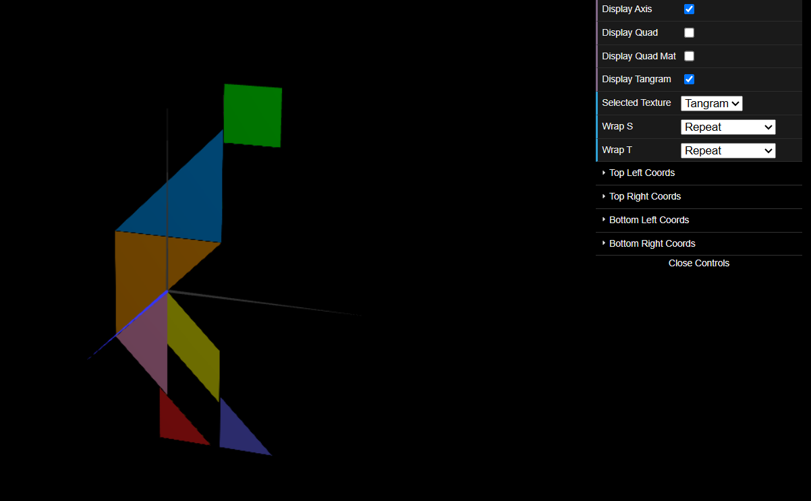
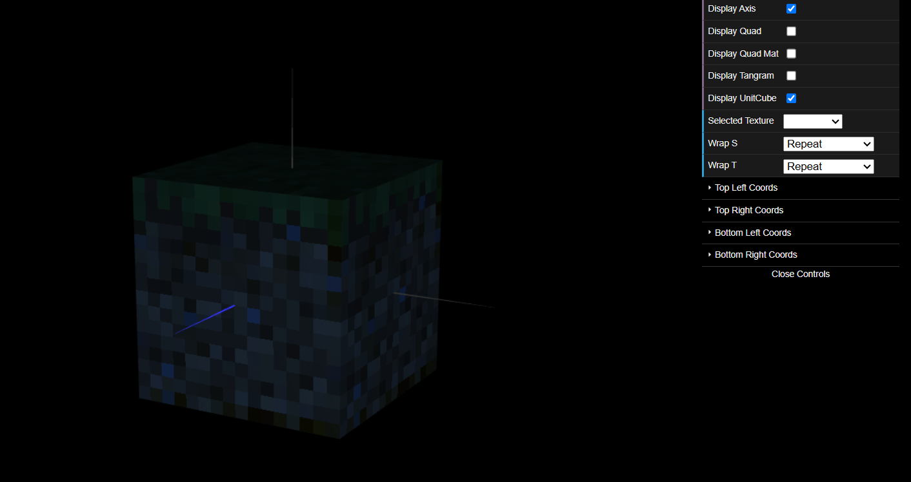

# CG 2024/2025

## Group T11G05

## TP 4 Notes

### 4-1

- Wrong implementation of TriangleBig and TriangleSmall made us run into some problems when trying to correcly alocate the texture. Also some doubts when it came to make two different textures for the same function of TriangleBig and TriangleSmall

### 4-2

- No problems

